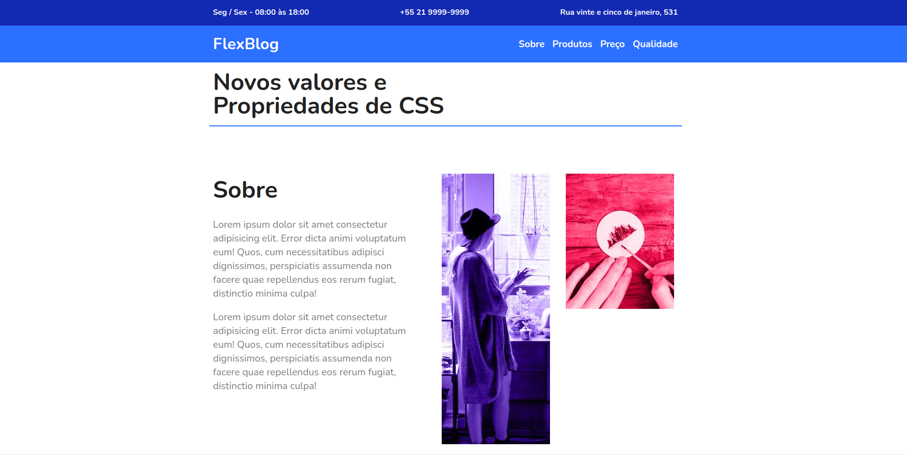

<h1 style="text-align:center;" >FlexBlog</h1>
 
  
  
# Sobre

Esse projeto é apenas um Layout de um site (sem funcionalidades). Nele eu pratiquei os conceitos de Flexbox, do CSS

#Tecnologia Utilizada

- HTML
- CSS
